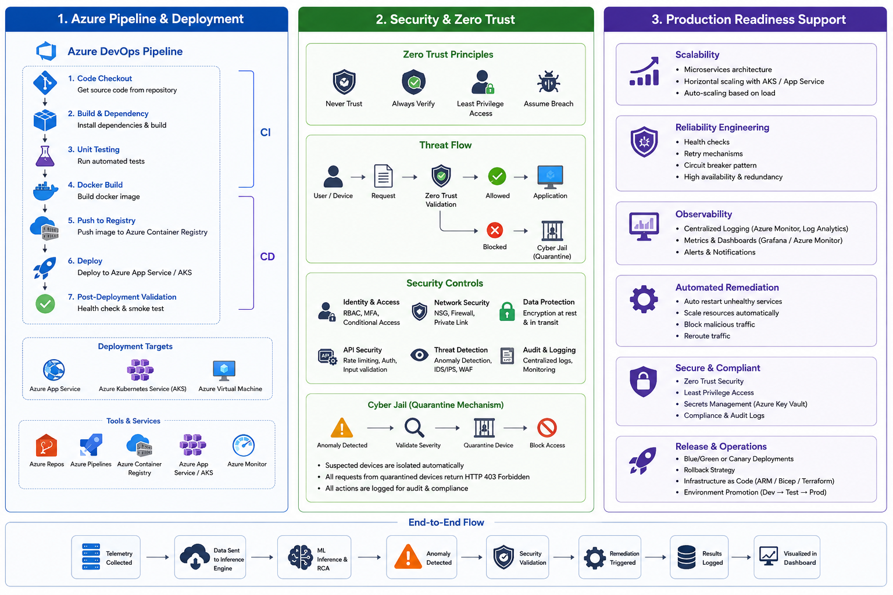

# Self Federated Anomaly Detection System for Cloud Infrastructure (SFAD)

## Project Overview

SFAD is a cloud-native platform for intelligent infrastructure monitoring and response. It collects telemetry from distributed workloads—including virtual machines, containers, servers, applications, and network systems—and uses machine learning to detect anomalies in real time.

The platform is designed to:

- detect infrastructure anomalies quickly
- identify likely root causes
- trigger automated remediation actions
- isolate suspicious workloads securely
- provide observability through dashboards and alerts

This is a practical implementation of a research-driven system that blends AI, security engineering, cloud infrastructure, and DevOps.

---

## Why It Matters

Modern cloud infrastructure produces massive amounts of telemetry, and static threshold-based monitoring is no longer enough. SFAD addresses common problems such as:

- false positives from threshold alerts
- undetected novel attack patterns
- slow incident response
- limited root cause visibility
- manual operations for recovery

By combining anomaly detection, federated learning, security controls, and automated remediation, SFAD delivers a more resilient and observability-driven infrastructure model.

---

## Key Capabilities

### Hybrid ML Anomaly Detection

The system uses two complementary models:

- **Isolation Forest** for infrastructure telemetry anomalies such as CPU spikes, memory leaks, disk saturation, and network abnormalities
- **Autoencoder Neural Network** for behavioral anomalies in logs and hidden error patterns

These models are fused to improve detection accuracy and reduce false alarms.

### Federated Learning

SFAD avoids centralized training of raw telemetry data. Instead, it supports federated updates so edge nodes can contribute learned model improvements without sharing sensitive raw data.

### Zero Trust Security and Cyber Jail

Every request is treated as untrusted until verified. When suspicious behavior is detected, the affected node or workload is isolated in a quarantine state, blocking access and logging actions for audit.

### Automated Remediation

The system can execute self-healing actions such as:

- restarting services after memory leaks
- rerouting traffic or scaling up load balancers during DDoS-style behavior
- throttling low-priority workloads under CPU pressure

### Observability Dashboard

The dashboard delivers:

- live metrics
- alert timelines
- incident reports
- root cause insights
- threat visualization

---

## Architecture

The system is built around a layered architecture:

1. **Cloud Infrastructure Layer** – source of telemetry from VMs, containers, servers, and applications
2. **Edge Client Layer** – collectors gather CPU, memory, disk, network, and log data
3. **Inference Engine Layer** – processes telemetry, detects anomalies, performs analysis, and triggers alerts
4. **Security Layer** – applies zero trust validation, threat analysis, and isolation
5. **Automated Remediation Layer** – performs recovery, scaling, blocking, or rerouting actions
6. **Observability Dashboard** – visualizes alerts, metrics, and incident summaries

---

## Test Usage and Validation

This implementation supports testing across multiple levels:

- **API validation** for telemetry ingestion and prediction endpoints
- **Model performance testing** to validate anomaly detection accuracy
- **Security flow testing** to verify quarantine and access-blocking behavior
- **Remediation verification** to ensure automated recovery actions execute correctly
- **Dashboard validation** to confirm observability and alert reporting

A representative workflow for testing:

1. Send simulated telemetry to the inference API
2. Verify the ML models produce expected anomaly scores
3. Confirm suspicious nodes enter quarantine when required
4. Check remediation actions execute successfully
5. Review dashboard output for correct metrics and incidents

---

## Practical Impact

SFAD is intended for infrastructure and security teams working with cloud-native platforms. The solution is especially relevant for:

- cloud operations
- SRE and reliability engineering
- security operations
- observability and monitoring
- hybrid and distributed system management

The project shows how AI and automation can reduce manual monitoring overhead, accelerate detection, and improve incident handling.

---

## My Contribution

I helped build this system with a strong focus on real-world Cloud and DevOps engineering. My work included:

- defining a production-ready architecture for telemetry collection, inference, and remediation
- containerizing services and designing deployment flows for cloud environments
- creating an Azure-inspired CI/CD pipeline for build, test, container publish, and deployment
- ensuring security-first behavior through a zero trust validation and quarantine mechanism
- designing observability from the start so incidents and root cause data are visible

This project was a great experience because it connected classroom research with practical engineering. Working with the team felt like returning to my engineering roots while helping deliver a system that is both robust and production-aware.

---

## What I Built and Implemented

I focused on turning the architecture into an implementable solution:

- built the FastAPI inference engine and validation logic
- integrated ML detection models with decision fusion
- implemented the Cyber Jail quarantine flow
- defined remediation action patterns for self-healing behavior
- structured observability data for dashboard visualization

The result is a testable system design that supports deployment, monitoring, and recovery in a cloud environment.

---

## Final Thoughts

SFAD demonstrates how security-aware anomaly detection, federated learning, and automation can work together in modern cloud infrastructure. This project reflects a practical engineering mindset: build solutions that are observable, resilient, and ready for production.

If you want to explore this further, the implementation in this repository is a solid starting point for cloud-native anomaly detection and self-healing operations.